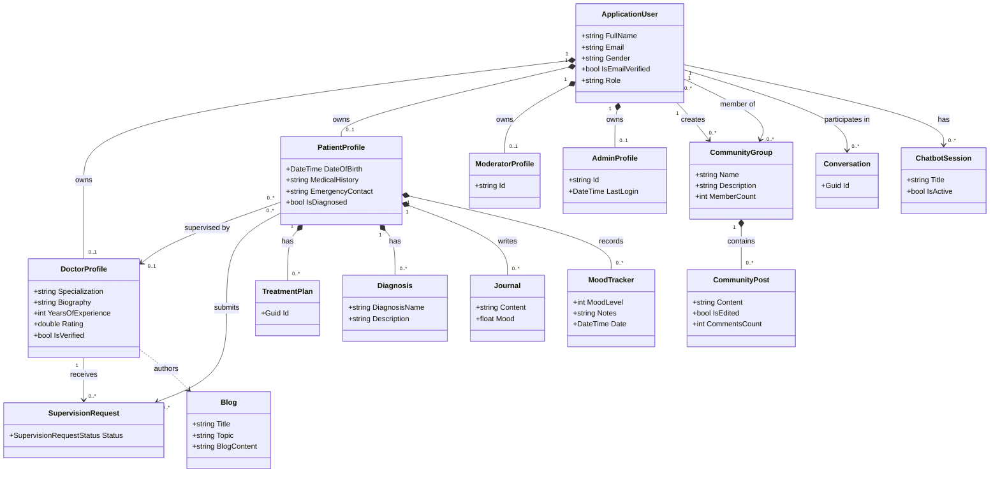
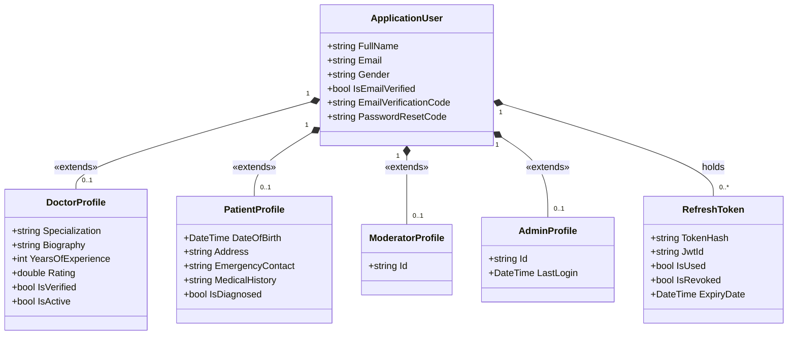
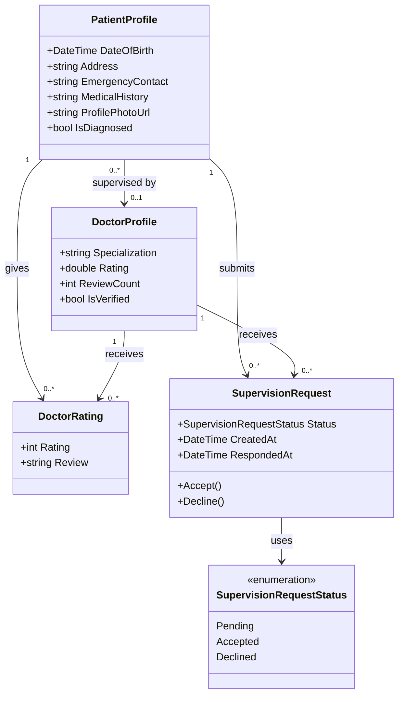
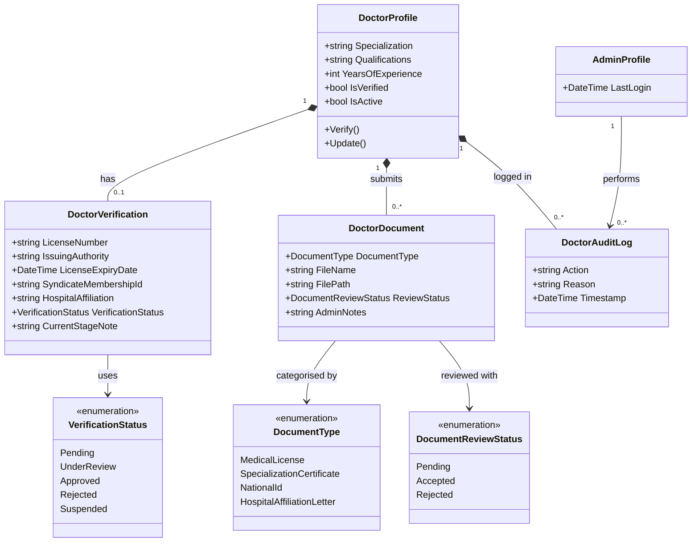
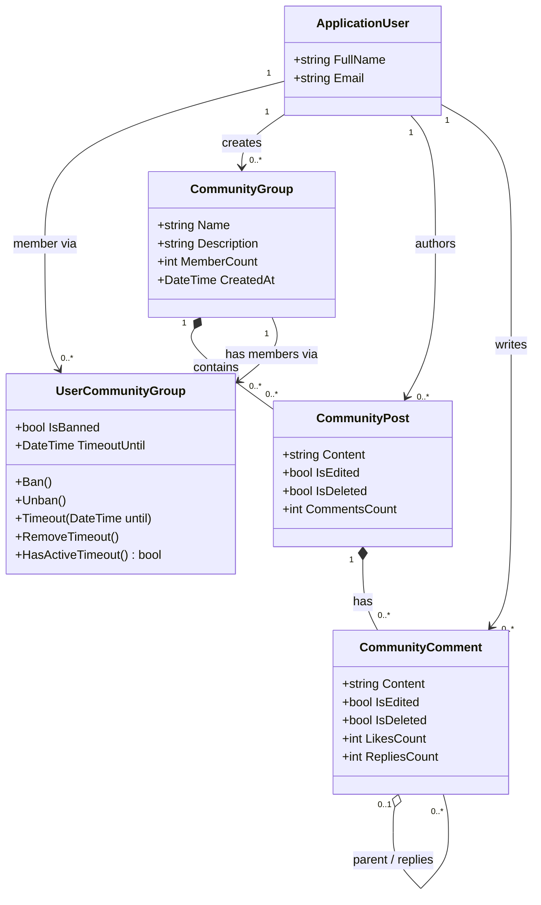
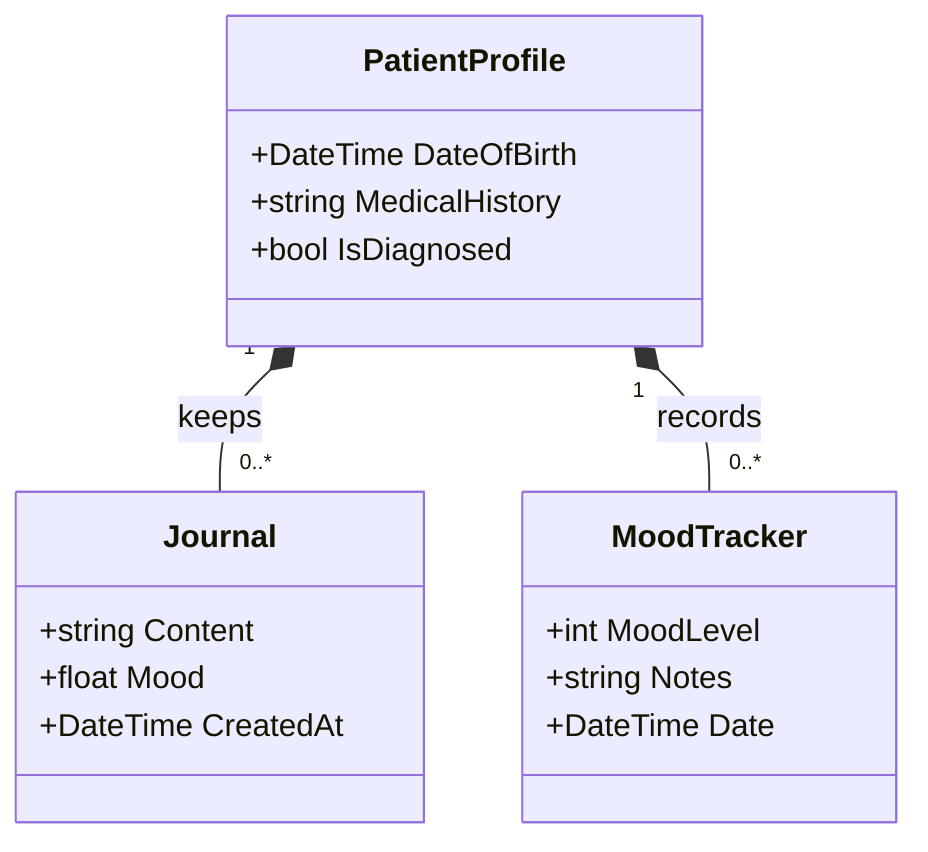
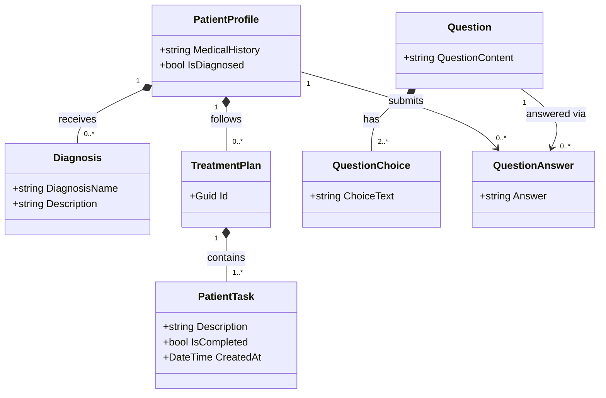
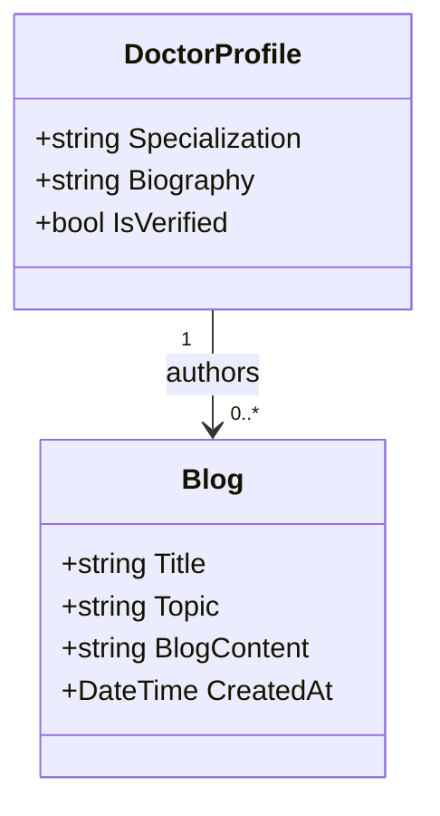
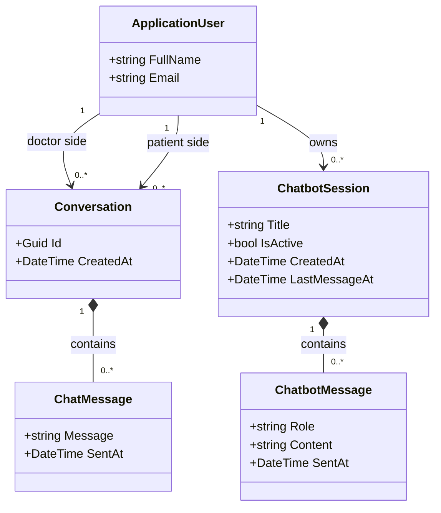

# Eirene – Domain Class Diagrams

> **Purpose:** This document presents the UML class diagrams for the *Eirene* mental-health platform domain model, derived directly from the source entities in `Eirene.DAL/Entities`. It is intended as documentation for a software engineering graduation report and focuses exclusively on domain semantics rather than implementation artefacts.

---

## Table of Contents

1. [Overall Domain Class Diagram](#1-overall-domain-class-diagram)
2. [Authentication & User Management](#2-authentication--user-management)
3. [Patient Management](#3-patient-management)
4. [Doctor Supervision](#4-doctor-supervision)
5. [Community Module](#5-community-module)
6. [Mental Wellness & Tracking](#6-mental-wellness--tracking)
7. [Mental Health Treatment](#7-mental-health-treatment)
8. [Blogging Module](#8-blogging-module)
9. [Communication Module](#9-communication-module)

---

## 1. Overall Domain Class Diagram

### Purpose

This high-level diagram shows the **primary domain entities** and the relationships between the major bounded contexts of Eirene. Only anchor classes are shown; detailed attributes appear in the per-module diagrams below.

### Classes Included

| Class | Bounded Context |
|---|---|
| `ApplicationUser` | Identity & Auth |
| `DoctorProfile` | Doctor Supervision |
| `PatientProfile` | Patient Management |
| `ModeratorProfile` | Identity & Auth |
| `AdminProfile` | Identity & Auth |
| `SupervisionRequest` | Doctor Supervision |
| `CommunityGroup` | Community |
| `CommunityPost` | Community |
| `TreatmentPlan` | Treatment |
| `Diagnosis` | Treatment |
| `Journal` | Wellness Tracking |
| `MoodTracker` | Wellness Tracking |
| `Blog` | Blogging |
| `Conversation` | Communication |
| `ChatbotSession` | Communication |

---

## 2. Authentication & User Management

### Purpose

Captures the **identity and role system** of the platform. `ApplicationUser` extends ASP.NET Identity's `IdentityUser` and is extended by role-specific profiles rather than using role-based sub-classing, allowing a clean polymorphic decomposition without ORM inheritance complexity.

### Classes

| Class | Role in Diagram |
|---|---|
| `ApplicationUser` | Central identity entity inherited from ASP.NET `IdentityUser` |
| `DoctorProfile` | Profile extension for users with the Doctor role |
| `PatientProfile` | Profile extension for users with the Patient role |
| `ModeratorProfile` | Profile extension for users with the Moderator role |
| `AdminProfile` | Profile extension for users with the Admin role |
| `RefreshToken` | Supports JWT token rotation |

### Enums

| Enum | Values | Used By |
|---|---|---|
| `Roles` *(constant class)* | `Patient`, `Doctor`, `Moderator`, `Admin` | ASP.NET Identity roles |

### Design Notes

- All profile classes share the same primary key as `ApplicationUser` (table-per-type relationship), making them true 1-to-1 extensions rather than associations.
- `RefreshToken` is included because it is a core security concern: it holds the token hash and revocation state, which are domain-relevant rather than purely infrastructural.
- `ModeratorProfile` and `AdminProfile` are currently thin entities with minimal attributes. **Recommendation:** consider merging them into a single `StaffProfile` with a `StaffRole` enum (`Admin | Moderator`) to reduce structural noise, unless their responsibilities are expected to diverge significantly.

---

## 3. Patient Management

### Purpose

Models the **patient as a domain citizen**: who they are, who supervises them, what ratings they give doctors, and how they track their own health over time. This module bridges Authentication (the user identity) with Treatment, Tracking, and Doctor Supervision.

### Classes

| Class | Role in Diagram |
|---|---|
| `PatientProfile` | Root aggregate for patient-specific data |
| `DoctorProfile` | Referenced as the supervising doctor |
| `DoctorRating` | Captures a patient's review of a doctor |
| `SupervisionRequest` | A patient's request to be supervised by a doctor |

### Enums

| Enum | Values | Used By |
|---|---|---|
| `SupervisionRequestStatus` | `Pending`, `Accepted`, `Declined` | `SupervisionRequest.Status` |

### Design Notes

- `DoctorRating` links both `PatientProfile` and `DoctorProfile`. It belongs in the Patient Management module because the patient is the actor who issues a rating; however, the rating aggregates into `DoctorProfile.Rating`, making it a cross-cutting concern.
- `SupervisionRequest` contains domain behaviour (`Accept()`, `Decline()`) and acts as a **state machine**, making it a proper domain entity rather than a pure join table.
- **Recommendation:** `DoctorRating` could be extracted into a standalone *Ratings & Reviews* module if the rating feature grows (e.g., with moderation workflows), but at the current scope it fits here.

---

## 4. Doctor Supervision

### Purpose

Captures the **lifecycle of doctor onboarding and administration**: credential submission, multi-stage verification, document management, and audit logging of admin actions. This module is distinct from Patient Management because its actors are doctors and administrators, not patients.

### Classes

| Class | Role in Diagram |
|---|---|
| `DoctorProfile` | The doctor being verified and managed |
| `DoctorVerification` | Holds the official license and syndicate details |
| `DoctorDocument` | Individual credential document submitted by the doctor |
| `DoctorAuditLog` | Records administrative actions taken on a doctor's account |
| `AdminProfile` | The admin who performs verification actions |

### Enums

| Enum | Values | Used By |
|---|---|---|
| `VerificationStatus` | `Pending`, `UnderReview`, `Approved`, `Rejected`, `Suspended` | `DoctorVerification.VerificationStatus` |
| `DocumentType` | `MedicalLicense`, `SpecializationCertificate`, `NationalId`, `HospitalAffiliationLetter` | `DoctorDocument.DocumentType` |
| `DocumentReviewStatus` | `Pending`, `Accepted`, `Rejected` | `DoctorDocument.ReviewStatus` |

### Design Notes

- `DoctorVerification` is a **1-to-1 aggregate** of `DoctorProfile`; it models the formal credential record rather than the operational profile, separating concerns cleanly.
- `DoctorDocument` supports multiple document types per doctor, each independently reviewable — a good representation of a real-world multi-step verification workflow.
- `DoctorAuditLog` references `AdminProfile` indirectly via `ApplicationUser`, which means the audit log survives even if admin roles change. This is correct domain behaviour.
- **Recommendation:** `DoctorVerification` and `DoctorDocument` could be composed into a `VerificationPackage` value object in a richer DDD model, but the current structure is clear and pragmatically suitable.

---

## 5. Community Module

### Purpose

Models the **peer-support community feature**: groups that users create and join, posts within those groups, threaded comments, and membership-level moderation (ban / timeout). The community is a social space shared by patients and doctors alike.

### Classes

| Class | Role in Diagram |
|---|---|
| `CommunityGroup` | A named support group with an owner and members |
| `UserCommunityGroup` | Join entity enriched with membership moderation state |
| `CommunityPost` | A content item published to a group |
| `CommunityComment` | A comment on a post; supports self-referential threading |

### Design Notes

- `UserCommunityGroup` is **not a plain join table**: it carries `IsBanned`, `TimeoutUntil`, and four domain methods (`Ban()`, `Unban()`, `Timeout()`, `RemoveTimeout()`), qualifying it as a proper **association class** or aggregate root in its own right.
- `CommunityComment.ParentCommentId` enables **recursive nesting** (replies to replies). The self-association is shown as a reflexive arrow.
- `CommunityGroup.MemberCount` and `CommunityPost.CommentsCount` are denormalised counters. In a domain diagram these are valid attributes because they represent observable state.
- **Recommendation:** `UserCommunityGroup` should be renamed to `GroupMembership` in future refactoring to better express its domain meaning and avoid the implementation-level "UserCommunity" prefix pattern.

---

## 6. Mental Wellness & Tracking

### Purpose

Models **self-reported wellbeing data** generated by patients on a daily or periodic basis. This module is intentionally patient-centric and separate from the Treatment module, because tracking is a self-service, continuous activity, whereas treatment is doctor-prescribed.

### Classes

| Class | Role in Diagram |
|---|---|
| `Journal` | A patient's private written reflective entry with an embedded mood score |
| `MoodTracker` | A lightweight daily mood log entry with an integer mood level and optional notes |

### Design Notes

- `Journal` includes a `Mood` field (`float`), making it a hybrid entity combining a qualitative entry (text) with a quantitative signal. This is a valid domain design for a mental health app where mood is tied directly to journal context.
- `MoodTracker` is a separate, lighter-weight entity for mood-only snapshots that do not require a full journal entry. Both entities are owned by `PatientProfile`.
- **Recommendation:** The relationship between `Journal` and `PatientProfile` is via `ApplicationUser` in the current implementation (the `PatientId` field maps to `ApplicationUser.Id`, not `PatientProfile.Id`). For domain clarity, both `Journal` and `MoodTracker` should reference `PatientProfile` directly. This is noted as a minor structural inconsistency in the current codebase.
- Consider adding a `MoodLevel` enum (e.g., `VeryLow`, `Low`, `Neutral`, `High`, `VeryHigh`) to replace the bare integer and make the domain more expressive.

---

## 7. Mental Health Treatment

### Purpose

Models the **clinical treatment workflow** between a doctor and a patient: the diagnosis established by the doctor, the treatment plan derived from it, the individual tasks assigned to the patient, and the diagnostic questionnaire system used to screen patients.

### Classes

| Class | Role in Diagram |
|---|---|
| `Diagnosis` | A clinical finding recorded against a patient |
| `TreatmentPlan` | A container that groups assigned therapeutic tasks |
| `PatientTask` | An individual actionable task within a treatment plan |
| `Question` | A questionnaire question used in mental health screening |
| `QuestionChoice` | A selectable answer option for a multiple-choice question |
| `QuestionAnswer` | A patient's recorded answer to a specific question |

### Design Notes

- `TreatmentPlan` → `PatientTask` represents a **composition**: tasks cannot exist independently of a plan.
- `Question` → `QuestionChoice` also represents a composition: choices are part of the question definition.
- `QuestionAnswer` links a `Question` and a patient (via `ApplicationUser`), recording what the patient answered. This is a **many-to-many association reified** as an entity.
- **Recommendation:**
  - `TreatmentPlan` is currently very thin (only an `Id` and a `UserId`). It should include at minimum a `StartDate`, `EndDate`, and a descriptive `Title` to be meaningful as a domain entity.
  - `Diagnosis` and `TreatmentPlan` both reference `ApplicationUser` directly rather than `PatientProfile`. For domain consistency these should reference `PatientProfile`.
  - A `QuestionnaireSession` entity could aggregate a patient's set of `QuestionAnswer` entries for a given screening session, providing traceability.

---

## 8. Blogging Module

### Purpose

Models the **educational content publishing** feature where verified doctors author blog posts on mental health topics for the general platform audience.

### Classes

| Class | Role in Diagram |
|---|---|
| `Blog` | A doctor-authored article with a title, topic, and content body |

### Design Notes

- `Blog` currently references `ApplicationUser` directly (via `DoctorId`) rather than `DoctorProfile`. This means there is no enforcement at the entity level that only doctors can author blogs. **Recommendation:** change the foreign key to reference `DoctorProfile.Id` to make the constraint explicit in the domain model.
- `Blog` is a standalone, simple entity. Given its small footprint, it does not yet warrant sub-entities (tags, categories, comments). If those features are added, the module will become richer.
- A `BlogStatus` enum (`Draft`, `Published`, `Archived`) would add meaningful domain state to the entity.

---

## 9. Communication Module

### Purpose

Models the **two-channel communication system** of Eirene: (1) direct text messaging between a doctor and patient through a shared `Conversation`, and (2) AI-powered chatbot sessions accessible by any user.

### Classes

| Class | Role in Diagram |
|---|---|
| `Conversation` | A named channel shared between exactly one doctor and one patient |
| `ChatMessage` | A single message sent within a `Conversation` |
| `ChatbotSession` | A user's session with the AI chatbot |
| `ChatbotMessage` | A single turn (user or assistant) within a `ChatbotSession` |

### Design Notes

- `Conversation` and the `ChatbotSession` / `ChatbotMessage` pair model **two distinct communication paradigms** and should remain separate even though both deal with messaging.
- `ChatbotMessage.Role` (a string) distinguishes `"user"` from `"assistant"` turns. **Recommendation:** replace the bare `string` with a `MessageRole` enum (`User`, `Assistant`, `System`) for domain expressiveness.
- `ChatMessage` is minimal (sender, content, timestamp). In a production system, read receipts, edit history, or attachments could extend it; for now the current model is sufficient.
- `Conversation` currently has no reference back to `ChatMessage` in the entity definition, while `ChatMessage` holds `ConversationId`. The navigation property is missing on the aggregate root. **Recommendation:** add `ICollection<ChatMessage> Messages` to `Conversation` to close the aggregate boundary.

---

## Appendix A – Relationship Legend

| Notation | Meaning |
|---|---|
| `*--` | Composition (child cannot exist without parent) |
| `o--` | Aggregation (child can exist independently) |
| `-->` | Association (directed dependency) |
| `..>` | Dependency (weaker, often navigational) |
| `<\|--` | Inheritance / Generalisation |
| `1`, `0..1`, `0..*`, `1..*` | Multiplicity |

---

## Appendix B – Enumerations Summary

| Enum | Module | Values |
|---|---|---|
| `SupervisionRequestStatus` | Doctor Supervision / Patient Management | `Pending`, `Accepted`, `Declined` |
| `VerificationStatus` | Doctor Supervision | `Pending`, `UnderReview`, `Approved`, `Rejected`, `Suspended` |
| `DocumentType` | Doctor Supervision | `MedicalLicense`, `SpecializationCertificate`, `NationalId`, `HospitalAffiliationLetter` |
| `DocumentReviewStatus` | Doctor Supervision | `Pending`, `Accepted`, `Rejected` |
| `Roles` *(constant class)* | Authentication | `Patient`, `Doctor`, `Moderator`, `Admin` |

---

## Appendix C – Cross-Module Recommendations

| Issue | Affected Modules | Recommendation |
|---|---|---|
| `Journal` and `MoodTracker` reference `ApplicationUser` instead of `PatientProfile` | Wellness & Tracking | Change FK to `PatientProfile.Id` for consistency |
| `Diagnosis` and `TreatmentPlan` also reference `ApplicationUser` | Treatment | Same correction; this hides the patient-doctor domain relationship |
| `Blog` references `ApplicationUser` instead of `DoctorProfile` | Blogging | Change FK to enforce doctor-only authorship at the domain level |
| `ModeratorProfile` and `AdminProfile` are near-empty entities | Authentication | Merge into a `StaffProfile` with a `StaffRole` enum, unless future divergence is planned |
| `TreatmentPlan` lacks descriptive attributes | Treatment | Add `Title`, `StartDate`, `EndDate`, `Description` |
| `Conversation` missing `Messages` navigation property | Communication | Add `ICollection<ChatMessage> Messages` to complete the aggregate |
| `ChatbotMessage.Role` is a bare `string` | Communication | Replace with `MessageRole` enum (`User`, `Assistant`, `System`) |
| `UserCommunityGroup` name is implementation-flavoured | Community | Rename to `GroupMembership` for better domain expressiveness |
